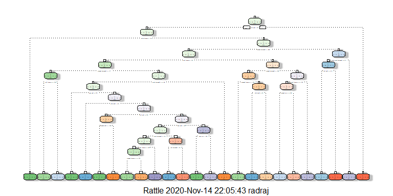

## Executive Summary

###### Using devices such as Jawbone Up, Nike FuelBand, and Fitbit it is now possible to collect a large amount of data about personal activity relatively inexpensively. These type of devices are part of the quantified self movement – a group of enthusiasts who take measurements about themselves regularly to improve their health, to find patterns in their behavior, or because they are tech geeks. One thing that people regularly do is quantify how much of a particular activity they do, but they rarely quantify how well they do it. In this project,  goal will be to use data from accelerometers on the belt, forearm, arm, and dumbell of 6 participants. They were asked to perform barbell lifts correctly and incorrectly in 5 different ways.More information is available from the website here: http://web.archive.org/web/20161224072740/http:/groupware.les.inf.puc-rio.br/har (see the section on the Weight Lifting Exercise Dataset).

###### The goal of this project is to predict the manner in which they did the exercise.

## Library and data loading

\scriptsize

```r
# Loading the mtcars dataset
library(caret)
```

```
## Loading required package: lattice
```

```
## Loading required package: ggplot2
```

```r
library(rattle)
```

```
## Loading required package: tibble
```

```
## Loading required package: bitops
```

```
## Rattle: A free graphical interface for data science with R.
## Version 5.4.0 Copyright (c) 2006-2020 Togaware Pty Ltd.
## Type 'rattle()' to shake, rattle, and roll your data.
```

```r
library(rpart)

# Loading training data
Train_In <- read.csv(url("https://d396qusza40orc.cloudfront.net/predmachlearn/pml-training.csv"),header=TRUE)
dim(Train_In)
```

```
## [1] 19622   160
```

```r
# Loading testing data and keeping for Validation purposes
Valid_In <- read.csv(url("https://d396qusza40orc.cloudfront.net/predmachlearn/pml-testing.csv"),header=TRUE)
dim(Valid_In)
```

```
## [1]  20 160
```

```r
str(Train_In)
```

```
## 'data.frame':	19622 obs. of  160 variables:
##  $ X                       : int  1 2 3 4 5 6 7 8 9 10 ...
##  $ user_name               : chr  "carlitos" "carlitos" "carlitos" "carlitos" ...
##  $ raw_timestamp_part_1    : int  1323084231 1323084231 1323084231 1323084232 1323084232 1323084232 1323084232 1323084232 1323084232 1323084232 ...
##  $ raw_timestamp_part_2    : int  788290 808298 820366 120339 196328 304277 368296 440390 484323 484434 ...
##  $ cvtd_timestamp          : chr  "05/12/2011 11:23" "05/12/2011 11:23" "05/12/2011 11:23" "05/12/2011 11:23" ...
##  $ new_window              : chr  "no" "no" "no" "no" ...
##  $ num_window              : int  11 11 11 12 12 12 12 12 12 12 ...
##  $ roll_belt               : num  1.41 1.41 1.42 1.48 1.48 1.45 1.42 1.42 1.43 1.45 ...
##  $ pitch_belt              : num  8.07 8.07 8.07 8.05 8.07 8.06 8.09 8.13 8.16 8.17 ...
##  $ yaw_belt                : num  -94.4 -94.4 -94.4 -94.4 -94.4 -94.4 -94.4 -94.4 -94.4 -94.4 ...
##  $ total_accel_belt        : int  3 3 3 3 3 3 3 3 3 3 ...
##  $ kurtosis_roll_belt      : chr  "" "" "" "" ...
##  $ kurtosis_picth_belt     : chr  "" "" "" "" ...
##  $ kurtosis_yaw_belt       : chr  "" "" "" "" ...
##  $ skewness_roll_belt      : chr  "" "" "" "" ...
##  $ skewness_roll_belt.1    : chr  "" "" "" "" ...
##  $ skewness_yaw_belt       : chr  "" "" "" "" ...
##  $ max_roll_belt           : num  NA NA NA NA NA NA NA NA NA NA ...
##  $ max_picth_belt          : int  NA NA NA NA NA NA NA NA NA NA ...
##  $ max_yaw_belt            : chr  "" "" "" "" ...
##  $ min_roll_belt           : num  NA NA NA NA NA NA NA NA NA NA ...
##  $ min_pitch_belt          : int  NA NA NA NA NA NA NA NA NA NA ...
##  $ min_yaw_belt            : chr  "" "" "" "" ...
##  $ amplitude_roll_belt     : num  NA NA NA NA NA NA NA NA NA NA ...
##  $ amplitude_pitch_belt    : int  NA NA NA NA NA NA NA NA NA NA ...
##  $ amplitude_yaw_belt      : chr  "" "" "" "" ...
##  $ var_total_accel_belt    : num  NA NA NA NA NA NA NA NA NA NA ...
##  $ avg_roll_belt           : num  NA NA NA NA NA NA NA NA NA NA ...
##  $ stddev_roll_belt        : num  NA NA NA NA NA NA NA NA NA NA ...
##  $ var_roll_belt           : num  NA NA NA NA NA NA NA NA NA NA ...
##  $ avg_pitch_belt          : num  NA NA NA NA NA NA NA NA NA NA ...
##  $ stddev_pitch_belt       : num  NA NA NA NA NA NA NA NA NA NA ...
##  $ var_pitch_belt          : num  NA NA NA NA NA NA NA NA NA NA ...
##  $ avg_yaw_belt            : num  NA NA NA NA NA NA NA NA NA NA ...
##  $ stddev_yaw_belt         : num  NA NA NA NA NA NA NA NA NA NA ...
##  $ var_yaw_belt            : num  NA NA NA NA NA NA NA NA NA NA ...
##  $ gyros_belt_x            : num  0 0.02 0 0.02 0.02 0.02 0.02 0.02 0.02 0.03 ...
##  $ gyros_belt_y            : num  0 0 0 0 0.02 0 0 0 0 0 ...
##  $ gyros_belt_z            : num  -0.02 -0.02 -0.02 -0.03 -0.02 -0.02 -0.02 -0.02 -0.02 0 ...
##  $ accel_belt_x            : int  -21 -22 -20 -22 -21 -21 -22 -22 -20 -21 ...
##  $ accel_belt_y            : int  4 4 5 3 2 4 3 4 2 4 ...
##  $ accel_belt_z            : int  22 22 23 21 24 21 21 21 24 22 ...
##  $ magnet_belt_x           : int  -3 -7 -2 -6 -6 0 -4 -2 1 -3 ...
##  $ magnet_belt_y           : int  599 608 600 604 600 603 599 603 602 609 ...
##  $ magnet_belt_z           : int  -313 -311 -305 -310 -302 -312 -311 -313 -312 -308 ...
##  $ roll_arm                : num  -128 -128 -128 -128 -128 -128 -128 -128 -128 -128 ...
##  $ pitch_arm               : num  22.5 22.5 22.5 22.1 22.1 22 21.9 21.8 21.7 21.6 ...
##  $ yaw_arm                 : num  -161 -161 -161 -161 -161 -161 -161 -161 -161 -161 ...
##  $ total_accel_arm         : int  34 34 34 34 34 34 34 34 34 34 ...
##  $ var_accel_arm           : num  NA NA NA NA NA NA NA NA NA NA ...
##  $ avg_roll_arm            : num  NA NA NA NA NA NA NA NA NA NA ...
##  $ stddev_roll_arm         : num  NA NA NA NA NA NA NA NA NA NA ...
##  $ var_roll_arm            : num  NA NA NA NA NA NA NA NA NA NA ...
##  $ avg_pitch_arm           : num  NA NA NA NA NA NA NA NA NA NA ...
##  $ stddev_pitch_arm        : num  NA NA NA NA NA NA NA NA NA NA ...
##  $ var_pitch_arm           : num  NA NA NA NA NA NA NA NA NA NA ...
##  $ avg_yaw_arm             : num  NA NA NA NA NA NA NA NA NA NA ...
##  $ stddev_yaw_arm          : num  NA NA NA NA NA NA NA NA NA NA ...
##  $ var_yaw_arm             : num  NA NA NA NA NA NA NA NA NA NA ...
##  $ gyros_arm_x             : num  0 0.02 0.02 0.02 0 0.02 0 0.02 0.02 0.02 ...
##  $ gyros_arm_y             : num  0 -0.02 -0.02 -0.03 -0.03 -0.03 -0.03 -0.02 -0.03 -0.03 ...
##  $ gyros_arm_z             : num  -0.02 -0.02 -0.02 0.02 0 0 0 0 -0.02 -0.02 ...
##  $ accel_arm_x             : int  -288 -290 -289 -289 -289 -289 -289 -289 -288 -288 ...
##  $ accel_arm_y             : int  109 110 110 111 111 111 111 111 109 110 ...
##  $ accel_arm_z             : int  -123 -125 -126 -123 -123 -122 -125 -124 -122 -124 ...
##  $ magnet_arm_x            : int  -368 -369 -368 -372 -374 -369 -373 -372 -369 -376 ...
##  $ magnet_arm_y            : int  337 337 344 344 337 342 336 338 341 334 ...
##  $ magnet_arm_z            : int  516 513 513 512 506 513 509 510 518 516 ...
##  $ kurtosis_roll_arm       : chr  "" "" "" "" ...
##  $ kurtosis_picth_arm      : chr  "" "" "" "" ...
##  $ kurtosis_yaw_arm        : chr  "" "" "" "" ...
##  $ skewness_roll_arm       : chr  "" "" "" "" ...
##  $ skewness_pitch_arm      : chr  "" "" "" "" ...
##  $ skewness_yaw_arm        : chr  "" "" "" "" ...
##  $ max_roll_arm            : num  NA NA NA NA NA NA NA NA NA NA ...
##  $ max_picth_arm           : num  NA NA NA NA NA NA NA NA NA NA ...
##  $ max_yaw_arm             : int  NA NA NA NA NA NA NA NA NA NA ...
##  $ min_roll_arm            : num  NA NA NA NA NA NA NA NA NA NA ...
##  $ min_pitch_arm           : num  NA NA NA NA NA NA NA NA NA NA ...
##  $ min_yaw_arm             : int  NA NA NA NA NA NA NA NA NA NA ...
##  $ amplitude_roll_arm      : num  NA NA NA NA NA NA NA NA NA NA ...
##  $ amplitude_pitch_arm     : num  NA NA NA NA NA NA NA NA NA NA ...
##  $ amplitude_yaw_arm       : int  NA NA NA NA NA NA NA NA NA NA ...
##  $ roll_dumbbell           : num  13.1 13.1 12.9 13.4 13.4 ...
##  $ pitch_dumbbell          : num  -70.5 -70.6 -70.3 -70.4 -70.4 ...
##  $ yaw_dumbbell            : num  -84.9 -84.7 -85.1 -84.9 -84.9 ...
##  $ kurtosis_roll_dumbbell  : chr  "" "" "" "" ...
##  $ kurtosis_picth_dumbbell : chr  "" "" "" "" ...
##  $ kurtosis_yaw_dumbbell   : chr  "" "" "" "" ...
##  $ skewness_roll_dumbbell  : chr  "" "" "" "" ...
##  $ skewness_pitch_dumbbell : chr  "" "" "" "" ...
##  $ skewness_yaw_dumbbell   : chr  "" "" "" "" ...
##  $ max_roll_dumbbell       : num  NA NA NA NA NA NA NA NA NA NA ...
##  $ max_picth_dumbbell      : num  NA NA NA NA NA NA NA NA NA NA ...
##  $ max_yaw_dumbbell        : chr  "" "" "" "" ...
##  $ min_roll_dumbbell       : num  NA NA NA NA NA NA NA NA NA NA ...
##  $ min_pitch_dumbbell      : num  NA NA NA NA NA NA NA NA NA NA ...
##  $ min_yaw_dumbbell        : chr  "" "" "" "" ...
##  $ amplitude_roll_dumbbell : num  NA NA NA NA NA NA NA NA NA NA ...
##   [list output truncated]
```
\normalsize

##### The training data set is made of 19622 observations on 160 columns. 

## Cleaning the input data.

##### Removing variables containing missing values

```r
TrainData <- Train_In[, colSums(is.na(Train_In)) == 0]
dim(TrainData)
```

```
## [1] 19622    93
```

```r
ValidData <- Valid_In[, colSums(is.na(Valid_In)) == 0]
dim(ValidData)
```

```
## [1] 20 60
```

##### Removing user and timestamp variables 

```r
TrainData <- TrainData[, -c(1:7)]
dim(TrainData)
```

```
## [1] 19622    86
```

```r
ValidData <- ValidData[, -c(1:7)]
dim(ValidData)
```

```
## [1] 20 53
```


## Cleaning variables that are near zero variance and preparing for prediction


```r
set.seed(1234) 

# Removing variables that are near zero variance

inTrain <- createDataPartition(TrainData$classe, p = 0.7, list = FALSE)
TrainData <- TrainData[inTrain, ]
TestData <- TrainData[-inTrain, ]
dim(TrainData)
```

```
## [1] 13737    86
```

```r
dim(TestData)
```

```
## [1] 4123   86
```

```r
NZV <- nearZeroVar(TrainData)
TrainData <- TrainData[, -NZV]
TestData  <- TestData[, -NZV]
dim(TrainData)
```

```
## [1] 13737    53
```

```r
dim(TestData)
```

```
## [1] 4123   53
```

##### This brings us down to 53 variables.

##### In the following sections, we will test 3 different models: Classification Tree, Random Forest and Gradient Boosting Method

## Train with classification tree

\scriptsize

```r
set.seed(12345)

decisionTreeMod1 <- rpart(classe ~ ., data=TrainData, method="class")
fancyRpartPlot(decisionTreeMod1)
```

<!-- -->

```r
predictTreeMod1 <- predict(decisionTreeMod1, TestData, type = "class")
confusionMatrix(predictTreeMod1, as.factor(TestData$classe))$overall[1]
```

```
##  Accuracy 
## 0.7642493
```
\normalsize

##### The accuracy rate of this model is 0.7547

## Train with Random Forest

\scriptsize

```r
controlRF <- trainControl(method="cv", number=3, verboseIter=FALSE)
modRF1 <- train(classe ~ ., data=TrainData, method="rf", trControl=controlRF)
modRF1$finalModel
```

```
## 
## Call:
##  randomForest(x = x, y = y, mtry = param$mtry) 
##                Type of random forest: classification
##                      Number of trees: 500
## No. of variables tried at each split: 27
## 
##         OOB estimate of  error rate: 0.7%
## Confusion matrix:
##      A    B    C    D    E class.error
## A 3902    3    0    0    1 0.001024066
## B   19 2634    5    0    0 0.009029345
## C    0   17 2369   10    0 0.011268781
## D    0    1   26 2224    1 0.012433393
## E    0    2    5    6 2512 0.005148515
```

```r
predictRF1 <- predict(modRF1, newdata=TestData)
confusionMatrix(predictRF1, as.factor(TestData$classe))$overall[1]
```

```
## Accuracy 
##        1
```
\normalsize

##### This model shows an accuracy of 1, which this could be due to overfitting. So let's check against gbm model.

## Train with Generalized Boosted Regression model

\scriptsize

```r
set.seed(12345)
controlGBM <- trainControl(method = "repeatedcv", number = 5, repeats = 1)
modGBM  <- train(classe ~ ., data=TrainData, method = "gbm", trControl = controlGBM, verbose = FALSE)
modGBM$finalModel
```

```
## A gradient boosted model with multinomial loss function.
## 150 iterations were performed.
## There were 52 predictors of which 52 had non-zero influence.
```

```r
predictGBM <- predict(modGBM, newdata=TestData)
confusionMatrix(predictGBM, as.factor(TestData$classe))$overall[1]
```

```
##  Accuracy 
## 0.9730779
```
\normalsize

##### The accuracy of this model is 0.9721

##### It appears that Random Forest has the best accuracy. So we will use that against the validation data.

## Applying model created through Random Forect to predict from validation data

\scriptsize

```r
Results <- predict(modRF1, newdata=ValidData)
Results
```

```
##  [1] B A B A A E D B A A B C B A E E A B B B
## Levels: A B C D E
```
\normalsize

##### We will use these results to answer the course project quiz questions
